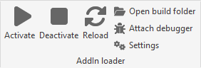
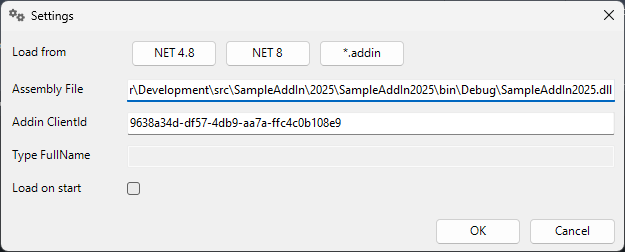
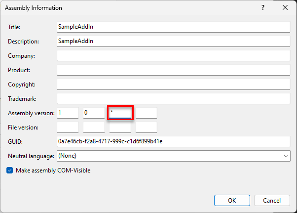

# InventorAddInDebugger
This is a standard Inventor add-in which enables developers to load and unload another add-in during development process without Inventor restart.
It is an alternative to Hot-Reload and unit-tests. It doesn't require special projects and debug settings.


## Supported versions

- Inventor 2022
- Inventor 2023
- Inventor 2024
- Inventor 2025

# Content
<!--TOC-->
- [Installation](#installation)
- [How to use](#how-to-use)
  - [Other tools](#other-tools)
- [Settings](#settings)
- [Sample projects](#sample-projects)
- [Add-in project settings](#add-in-project-settings)
  - [Disable add-in loading](#disable-add-in-loading)
  - [Set automatic versioning](#set-automatic-versioning)
  - [Set non-deterministic build](#set-non-deterministic-build)
  - [Disable auto-generated AssemblyInfo (.NET 8)](#disable-auto-generated-assemblyinfo-.net-8)
  - [Remove TargetFramwork from build path (.NET 8)](#remove-targetframwork-from-build-path-.net-8)
- [Build notes](#build-notes)
  - [AddInInfo80](#addininfo80)
  - [InventorAddInDebuggerSetup](#inventoraddindebuggersetup)
- [Contribution](#contribution)
- [Sources](#sources)
<!--/TOC-->

# Installation
Latest installer can be downloaded from [Releases](https://github.com/CSmichaelnavara/InventorAddInDebugger/releases)

Before first load you need to un-block this addin in Inventor AddIn Manager


# How to use

This tool can emulate loading and unloading of the addin. Commands are available in ribbon from:

- ZeroDoc->Tools
- Part->AddIns
- Assembly->AddIns
- Drawing->AddIns



**Activate** - If the add-in is not activated before, looks for the latest build. Prepare them and call `Activate` method
on it. If the add-in is in active state, this command is ommited.


**Deactivate** - If the add-in was activated before call `Deactivate` method
on it. If the add-in is not in active state, this command is ommited.

**Restart** - This command calls sequence `Deactivate`, look for new build, `Activate`


## Other tools

**Open build folder** - Opens the folder with the last loaded build of the add-in.

**Attach debugger** - Attaches the debugger to current Inventor process. After attach you need to press `F5` to continue, 
because it breaks the execution on the line in this command.

**Settings** - Start the settings process. 

# Settings



**Assembly File** - Contains full file name of the original build of the project.

**AddIn ClientId** - Contains GUID of the class which implements `Inventor.ApplicationAddInServer` interface.
Can be obtained from code or *.addin* file
``` csharp
[GuidAttribute("905d9707-d4cd-43dd-b6ed-9fd34c48893f")]
public class StandardAddInServer : Inventor.ApplicationAddInServer
{
   ...
}
```

**Type FullName** - Contains full name of the type which implements  `Inventor.ApplicationAddInServer` interface. 
This value is read-only and is only for information.

**Browse AddIn** - Allows you to navigate to the add-in build file. If the DLL file contains at least one add-in implementation, 
the values are automatically extracted from this file. You can choose from two loaders for specific runtimes.

**Load on start** - Loads the addin immediately during Inventor start.
Add-in must be configured before.

# Sample projects
Sample Inventor add-ins for features testing are available in this repository 
[Development/src/SampleAddIn](Development/src/SampleAddIn).

There are two sample addins. One for Invnetor 2022 and above and one for Invnetor 2025.

Both of them only displays message box with version of addin and its module. 
You can test the functionality of reloading addin on them.

# Add-in project settings
If you want to use this tool, you need to create VS project for Inventor AddIn and set the following properties. 

> All mentioned project modifications belongs to the first `PropertyGroup` in project file
```xml
<Project Sdk="Microsoft.NET.Sdk">
	<PropertyGroup>
		<TargetFramework>net8.0-windows</TargetFramework>
		<ProjectType>Local</ProjectType>
		...
		<!-- Mentioned nodes HERE -->
	</PropertyGroup>
	...
```

## Disable add-in loading
If you use default Inventor AddIn template you must disable loading of the add-in to Inventor. 
Inventor add-in template contains script in post-build events which copy the addin files to remote location
where the Inventor can found and load the add-in (`"%AppData%\Autodesk\ApplicationPlugins\$(TargetName)\"`). You must disable this first.

Delete or comment out this lines (Sample from default template for Inventor 2024)
```bat
XCopy "$(TargetPath)" "%AppData%\Autodesk\ApplicationPlugins\$(TargetName)\" /Y /R
XCopy "$(ProjectDir)Autodesk.InventorAddIn1.Inventor.addin" "%AppData%\Autodesk\ApplicationPlugins\$(TargetName)\" /Y /R   
```

If you use another method for loading, disable them too. The easiest way is to delete or change extension of the `*.addin` file.

## Set automatic versioning
In *Project settings* set assembly version to auto increment.


You can set the same in `AssemblyInfo.cs` file
```csharp
[assembly: AssemblyVersion("1.0.*")]
```

If you found in AssemblyInfo.cs file following line, remove it.
```csharp
// Remove this line
[assembly: AssemblyFileVersion("1.0")]
```

## Set non-deterministic build
In some cases in new projects you can't be able to set previous automatic versioning. 
You can obtain error message like this

>Error (active)	CS8357
>
>The specified version string '1.0.*' contains wildcards, which are not compatible with determinism. 
Either remove wildcards from the version string, or disable determinism for this compilation	


Uncheck the option in project settings `Build -> Advanced -> Deterministic`


Or you can to enable non-deterministic build in `.csproj` file. 

Unload the project or open project file in another editor and look for the following node. Set the value to `false`.
If the node is not found, create them.
```xml
<Deterministic>false</Deterministic>
```


## Disable auto-generated AssemblyInfo (.NET 8)
In .NET8 projects AssemblyInfo.cs can be auto-generated. In this case you can't edit them.

Uncheck the option in project settings `Build -> General -> Generate Assembly Info`


Or you can disable this feature in project file using this node
```xml
<GenerateAssemblyInfo>false</GenerateAssemblyInfo>
```


## Remove TargetFramwork from build path (.NET 8)
By default the build path of the project looks like *bin\Debug\net8.0-windows\\...*.
If you want to change them to *bin\Debug\\...* add the following node to project file

```xml
<AppendTargetFrameworkToOutputPath>false</AppendTargetFrameworkToOutputPath>
```

# Build notes

## AddInInfo80
When you make changes in this project, you need to `Publish` the project.
This process builds the result to single .exe file.

## InventorAddInDebuggerSetup
For loading and building this project you need to install [WiX Toolset](https://wixtoolset.org).

[Visual Studio 2019](https://marketplace.visualstudio.com/items?itemName=FireGiant.FireGiantHeatWaveDev16)

[Visual Studio 2022](https://marketplace.visualstudio.com/items?itemName=FireGiant.FireGiantHeatWaveDev17)


# Contribution
Feel free to make suggestions for improvement. And pull requests are welcome.

# Sources
> Icons source: https://www.iconfinder.com/iconsets/font-awesome-solid